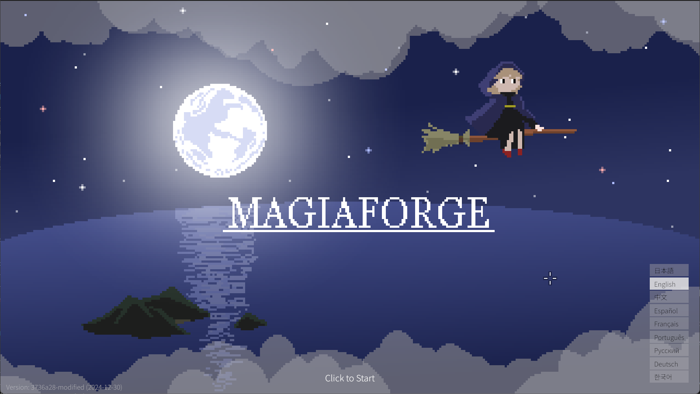
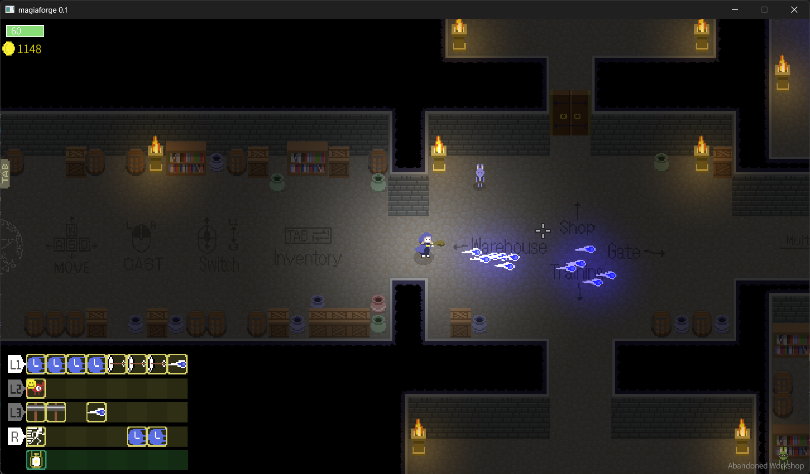

# magiaforge

Online Battle Royale Twin-stick Shooter. WIP.

### Demo

https://magiaforge.app/ (**Desktop Chrome only** for now)

- w/a/s/d: Move
- Mouse left button: Cast spells
- Mouse wheel: Switch wands
- Tab: Open inventory
- Esc: Open system menu

### Development

- `cargo run` to launch app locally
- `cargo build --profile dist` to build desktop app in release mode. (Note `cargo build` is for WASM build)
- `trunk serve` to run locally on browser with [trunk](https://trunkrs.dev/)
- `trunk build` to build web app and publish on GitHub Pages

Add `--features debug` to launch app in debug mode.

### Save Data Location

On Windows, save data is stored in `C:\Users\<USERNAME>\AppData\Roaming\magiaforge`.

In browsers, save data is stored in local storage under the key `magiaforge.magiaforgeconfig`.

### Asset credits

#### Sound Effects

- 芝生の上を歩く https://soundeffect-lab.info/sound/various/
- ひよこの鳴き声 https://soundeffect-lab.info/sound/animal/
- 打撃 1 https://soundeffect-lab.info/sound/battle/
- パンチ素振り https://soundeffect-lab.info/sound/battle/
- 革靴で歩く https://soundeffect-lab.info/sound/various/
- アスファルトの上を歩く 2 https://soundeffect-lab.info/sound/various/
- 決定ボタンを押す 48 https://soundeffect-lab.info/sound/button/
- 建物が少し崩れる 1 https://soundeffect-lab.info/sound/battle/
- メニューを開く 2 https://soundeffect-lab.info/sound/battle/
- ワープ https://soundeffect-lab.info/sound/battle/
- 体育館で走る https://soundeffect-lab.info/sound/various/
- 回復魔法 1 https://soundeffect-lab.info/sound/battle/
- カーソル移動 2 https://soundeffect-lab.info/sound/button/
- 爆発 3 https://soundeffect-lab.info/sound/battle/battle2.html
- イノシシの鳴き声 https://soundeffect-lab.info/sound/animal/
- ぷよん https://soundeffect-lab.info/sound/anime/
- お風呂 https://soundeffect-lab.info/sound/environment/

#### BGMs

- They https://dova-s.jp/bgm/play21009.html
- God's realm https://dova-s.jp/bgm/play20967.html
- 茫漠たる庭 https://dova-s.jp/bgm/play21154.html
- 荒れ地の先へ https://dova-s.jp/bgm/play17195.html
- 悪魔との戦闘 https://dova-s.jp/bgm/play11175.html
- Tides of Adventure https://dova-s.jp/bgm/play21129.html
- ダンジョンを踏破せし者 https://dova-s.jp/bgm/play20822.html
- 森のいざない https://dova-s.jp/bgm/play12135.html
- 迷宮 https://dova-s.jp/bgm/play8802.html
- 忘れられた神殿 https://dova-s.jp/bgm/play629.html
- アクション・バトル https://dova-s.jp/bgm/play12133.html
- Decisive Battle https://dova-s.jp/bgm/play5746.html
- 炎神の吐息 https://dova-s.jp/bgm/play298.html
- Sacred Sacrifice https://dova-s.jp/bgm/play6142.html
- FINAL BATTLE (TRAILER MUSIC) https://pixabay.com/music/electronic-final-battle-trailer-music-217488/
- Battle Fight Music (Dynamic Warrior Background Intro Theme) https://pixabay.com/music/upbeat-battle-fight-music-dynamic-warrior-background-intro-theme-272176/
- Battle Cinematic Trailer (Royalty Free Music) https://pixabay.com/music/main-title-battle-cinematic-trailer-royalty-free-music-210434/
- Human vs Machine (dark orchestral cinematic epic action) https://pixabay.com/music/main-title-human-vs-machine-dark-orchestral-cinematic-epic-action-271968/
- Midnight Forest https://pixabay.com/music/ambient-midnight-forest-184304/

#### Fonts

- DotGothic16 https://fonts.google.com/share?selection.family=DotGothic16
