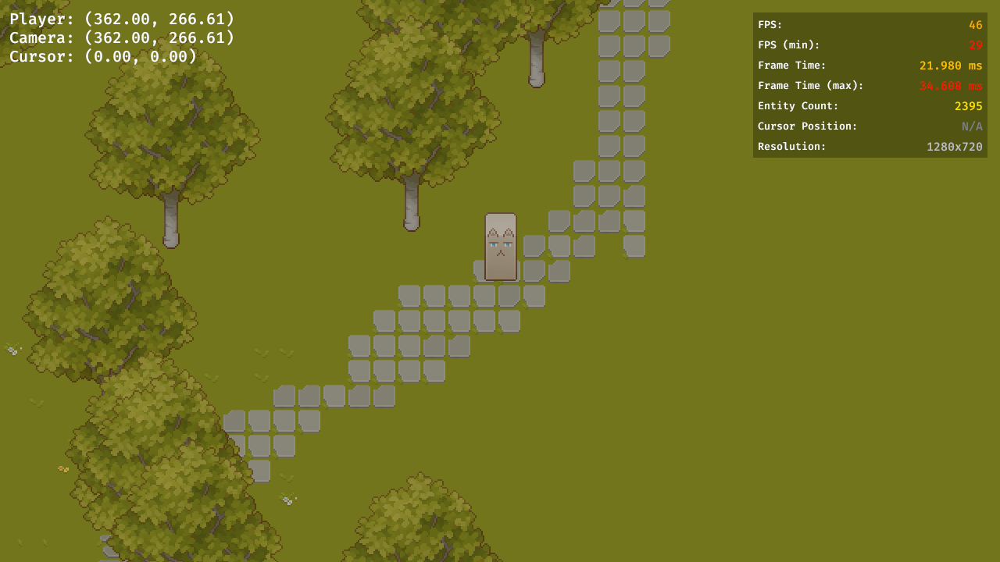

# bevy-wasm-example



### Usage

Run locally:

```bash
$ rustup target install wasm32-unknown-unknown

$ cargo install --locked trunk

$ trunk serve
```

Build and publish:

```bash
$ trunk build

# For GitHub Pages
$ cp -r dist/* docs/
```

### Demo

https://aratama.github.io/bevy-wasm-example/

### Notes

- https://trunkrs.dev/
- https://bevy-cheatbook.github.io/platforms/wasm.html
- https://gist.github.com/nakedible/f6a0d4bcbea1df7768e9ed425f6f33db
- Linux 用 Windows サブシステム で Linux GUI アプリを実行する https://learn.microsoft.com/ja-jp/windows/wsl/tutorials/gui-apps

### Assets

- https://cainos.itch.io/pixel-art-top-down-basic